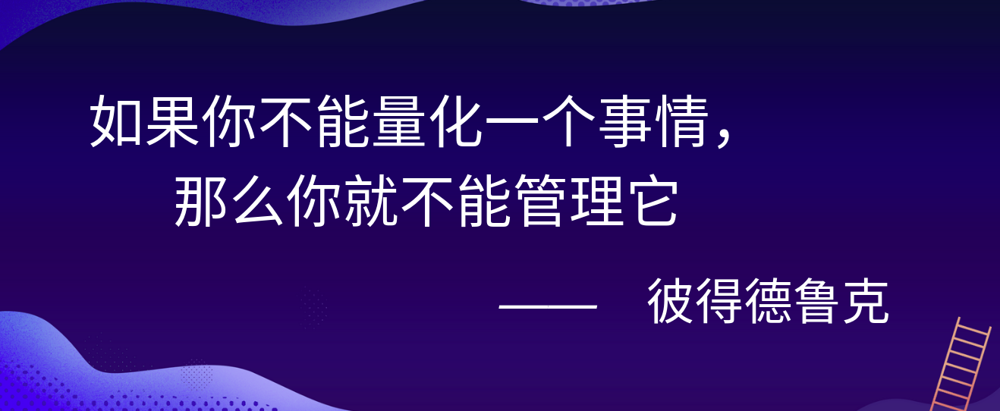
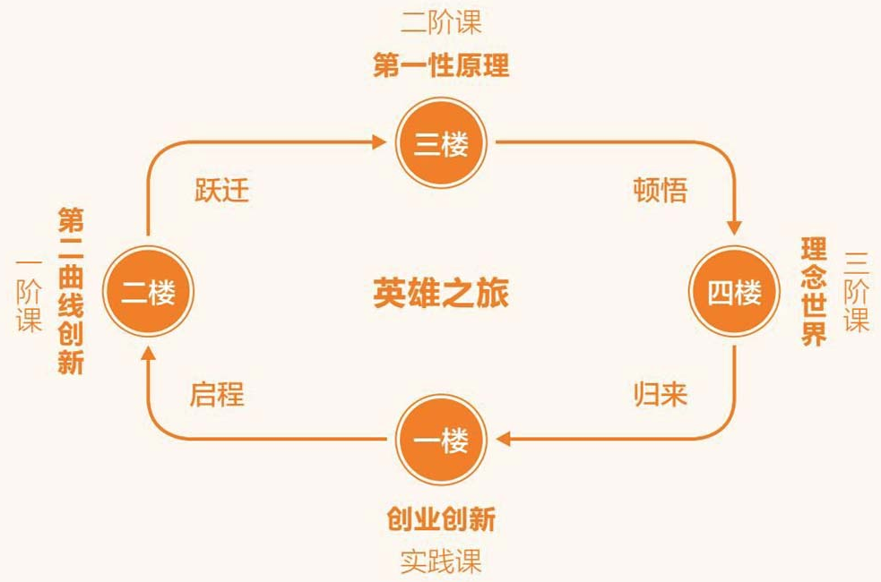

<!--
 * @Author: AlexZ33 775136985@qq.com
 * @Date: 2021-04-13 20:02:24
 * @LastEditors: AlexZ33 775136985@qq.com
 * @LastEditTime: 2022-07-29 17:22:42
 * @FilePath: /growth-hacker/README.md
 * @Description: 这是默认设置,请设置`customMade`, 打开koroFileHeader查看配置 进行设置: https://github.com/OBKoro1/koro1FileHeader/wiki/%E9%85%8D%E7%BD%AE
-->

# growth-hacker
增长黑客相关读书笔记
> 本笔记是基于[Max](https://baike.sogou.com/v179823990.htm) 培训以及黑客增长、广告学、创新营销相关书籍总结编纂
> Inspired by [Max](https://baike.sogou.com/v179823990.htm)

<b>全盘角度分析增长<b>

- 评估增长的可行性
- 评估增长重点
- 借鉴其他产品的增长思路

# 创新者

《创新者的基因》
《创新者的窘境》
《创新者的解答》

# 第一性原理

《创业创新》
- 熊彼特的“创造性破坏” 
- 克里斯坦森的“颠覆式创新”

《第二曲线创新》
《第一性原理》
- 亚里士多德的“第一性原理”
- 欧几里得的“公理化思维”
  
《理念世界》
- 柏拉图的“理念世界”
- 乔达摩的“觉性智慧”

# 英雄之旅

> 《千面英雄》中所描绘的英雄之旅，从启程开始，经历跃迁、顿悟，最终回到实践，并帮助更多的人一起看到更大的未来。

柏拉图把人类的认识分为4个等级，由低到高依次为：想象、信念、理智和知识
人类的思维分为4层，由低到高依次为：感性思维、理性思维、哲科思维和觉性智慧

