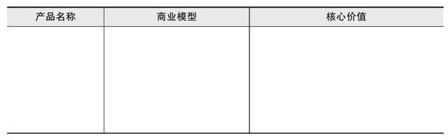
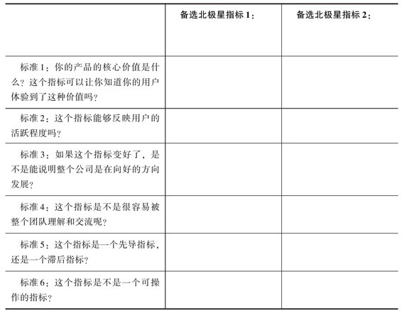
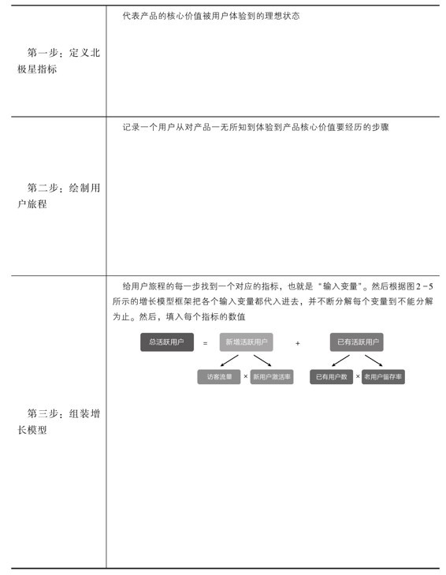
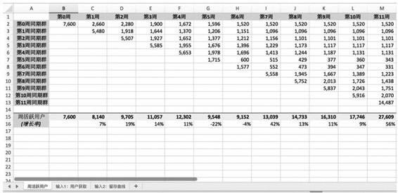
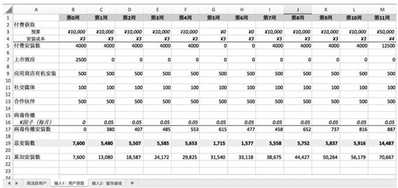
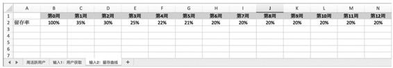
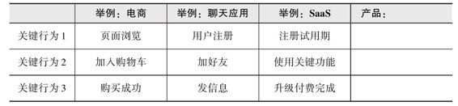
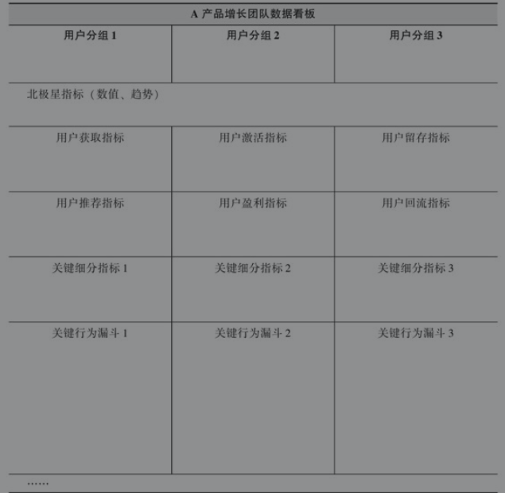
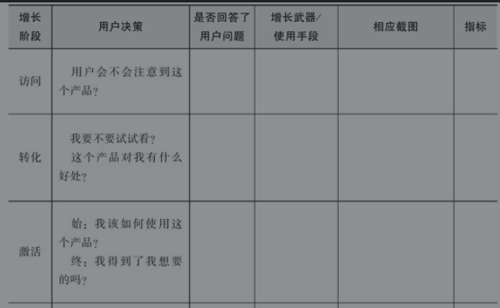
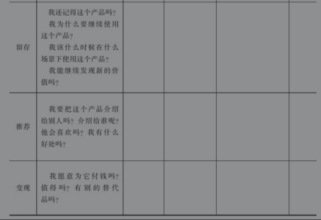

#! https://zhuanlan.zhihu.com/p/368754460
<!--
 * @Author: your name
 * @Date: 2021-04-28 16:05:09
 * @LastEditTime: 2021-04-29 11:36:12
 * @LastEditors: Please set LastEditors
 * @Description: In User Settings Edit
 * @FilePath: /growth-hacker/docs/互联网运营: 增长常用模板(五).md
-->

互联网运营: 增长常用模板(五)

------- 
> 可以直接拿来用的模板

# 1.模板1：定义北极星指标

判定北极星指标是否满足6个标准（填“是”或“否”）：

# 2.模板2：构建增长模型

# 3.模板3：构建定量增长模型

某移动应用<b>周活跃用户</b>定量增长模型如下所示

（1）北极星指标：周活跃用户

 
 (2)输入1: 用户获取

 

 (3) 输入2：留存曲线
 
 

 # 4.模板4：组装关键行为漏斗
  

# 5.模板5：增长仪表盘示例

# 6.模板6：用户决策心理地图

 

