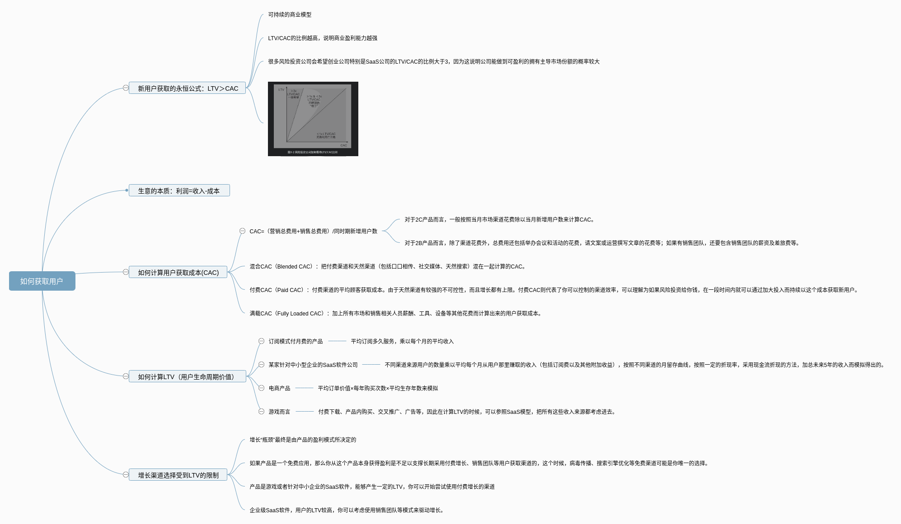

<!--
 * @Author: your name
 * @Date: 2021-04-28 19:51:20
 * @LastEditTime: 2021-04-28 20:00:39
 * @LastEditors: Please set LastEditors
 * @Description: In User Settings Edit
 * @FilePath: /growth-hacker/docs/互联网运营: 如何获取用户(六).md
-->

<b>CAC-LTV坐标图</b>

最左边，是低LTV的产品，如社交网络，适合使用那些便宜甚至免费的渠道，例如病毒传播等；最右边，是高LTV的产品，可以使用那些昂贵的渠道，如销售团队。以腾讯的不同产品为例，它们就处于CAC-LTV坐标图的不同位置。

> 一个产品想要做大，如达到1亿美元的量级，仅仅有产品—市场契合（PMF）是不够的，而是需要市场、产品、模型、渠道四者之间都有很好的契合

- ■市场—产品契合：有一个目标客户群存在，对这样一个产品有需要。
- ■产品—渠道契合：能够在特定渠道上，找到该产品的目标客户群。
- ■渠道—模型契合：产品的盈利模型和用户生命周期价值能够支持使用这些渠道的成本。
- ■模型—市场契合：目标客户群愿意为这个产品付钱，支持产品的盈利模型。

# 选择合适的用户获取渠道

# 黄金获取渠道：用户推荐（口碑营销）