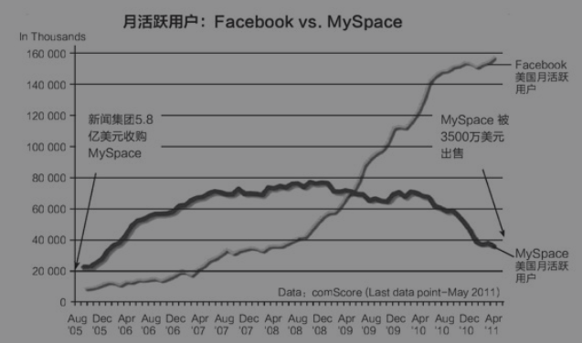
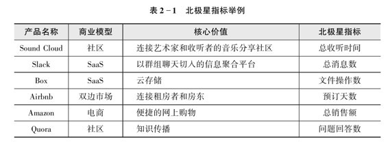
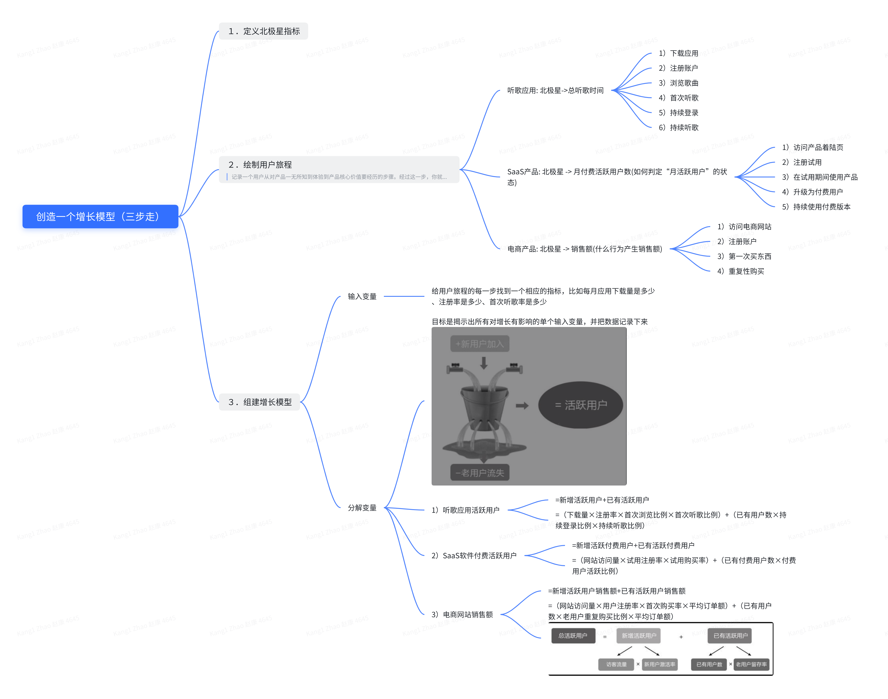
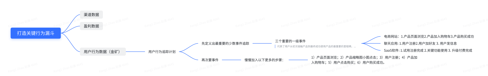
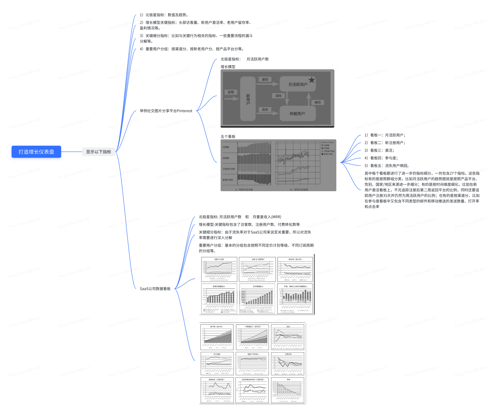
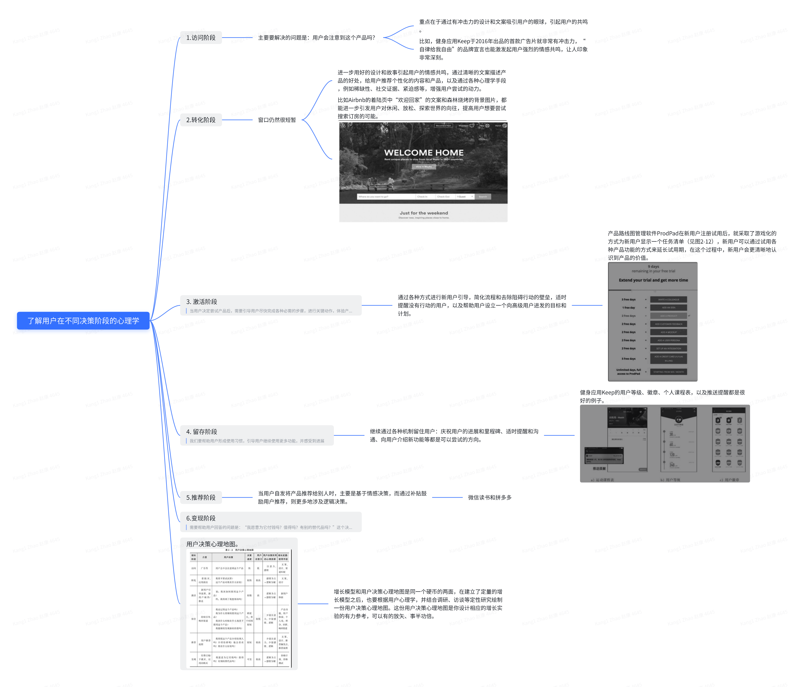

<!--
 * @Author: your name
 * @Date: 2021-04-22 14:19:38
 * @LastEditTime: 2021-04-28 16:00:07
 * @LastEditors: Please set LastEditors
 * @Description: In User Settings Edit
 * @FilePath: /growth-hacker/docs/互联网运营: 构建增长模型.md
-->

<b>“增长”</b>：用户增长和利润增长。

制作增长作战计划四要素：

- 方向标：北极星指标 
- 路线图: 增长模型
- 仪表盘: 关键指标看板（定量数据）
- 参考书: 用户心理决策地图(定性数据)
# 确定北极星指标(定方向)
确定北极星指标时需要反问几个问题：
- 你的产品核心价值是什么？这个指标能反映客户体验到了这种价值吗？(关于产品的客户价值看上一篇)
- 这个指标能反映用户的活跃度吗?
- 如果这个指标变好了，是不是能说明整个公司在往好的方向发展？
- 团队是否能理解这个指标？
  - 建议选一个绝对数作为北极星指标，而不是比例或百分比，比如，“总订单数”就比“订单额超过100元的订单比例”容易理解，也更便于各个团队之间协作和交流。
- 这是一个先导指标还是滞后指标？先导指标可以让你提前看到问题(比如用户留存就是个滞后指标，想要快速决策，你可能需要找日活这种指标)
  - “月活跃用户数”这样的先导指标
- 是不是一个可操作的指标？

北极星指标是一个随着团队发展阶段不同而变化的聚焦点，主要是为了让团队能够集中精力工作。例如
- 亚马逊的北极星指标是销售额
- Airbnb的北极星指标是预订天数，既可以反映用户活跃度，也代表了产品核心价值。
- 同为社交网站： MySpace公司运营的主要指标是“总注册用户数”，而Facebook“月活跃用户数”作为对外汇报和内部运营的主要指标。所以MySpace败了

> 你可能听说过所谓的虚荣指标（Vanity Metric）。虽然总注册用户数并不是一个彻头彻尾的虚荣指标，但它却有“虚荣”的成分在。为什么这么说？如果MySpace号称自己有100万名注册用户，这里面有多少是5年前注册的？有多少注册之后从来没有二次访问过？有多少试用了几次就变成了“僵尸用户”？有多少仍然在使用但是半年才上线一次？100万的注册用户可能在给投资人的数据里看起来好看，在员工那里说起来好听，但在公司的内部运营上，它也可能让MySpace误判了形势、走偏了方向、抓错了重点，最终在和Facebook的较量中败下阵来

<b>相比之下，从“总注册用户数”到“月活跃用户数”，看起来只是改变了三个字，却确保了Facebook内部的任何决策都是指向真实持续的活跃用户增长。</b>

<b>数据指标从来都不只是指标，它代表了管理层对用户价值和公司成功关系之间的理解，也会指导每个基层员工在日常工作中的一次次决策和执行。走正和跑偏之间，也许只有一个北极星指标的区别</b>

- 上述的几个北极星指标的例子都是绝对值，可以反映出用户的活跃度，代表了产品最核心的价值，同时可以指示公司的宏观经营状况。

# 构建增长模型（定道路）

> 当团队成员在每天的决策中，都以一个同样的增长模型为标准的时候，团队的方向和优先级变得更加一致，“劲儿往一处使”带来了成效的显著提高。
- 增长模型就是一个简化的数学公式，它包含了对用户或者利润增长有影响的主要变量，解释了这些变量如何相互作用，并最终影响增长。(下一章我们就讲解如何拆解增长模型，还记得前章说的永恒的商业模型Profit = ROI * Quantity吗)
- 增长模型三要素：
  - 输出变量：一般就是北极星指标
  - 输入变量：影响北极星指标的主要变量
  - 方程：变量之间的关系

Google Adsense滋润增长模型:

> 广告网络收入=广告印象数（广告主数量，广告位份额）X点击率（广告质量，广告单元位置）X平均点击成本（广告变现能力，用户质量）

基于这个模型，可以清晰看到对Adsense产品利润有贡献的因素，并且在做决策时，可以战略性放弃一些对利润增长没有贡献的工作。整个团队以一个同样的增长模型为标准，团队的方向和优先级变得一致，使得工作更具成效。

<b>创建一个增长模型思维导图</b>

> 看看你的增长模型，仔细观察一下，所有输入变量的数据，在不同的用户群组里面都类似吗？还是在不同的群组里有很大的不同？看看注册率、激活率和活跃度，试着找到用户行为明显不同的群组，你就能发现一些实验和改进的思路。比如，如果移动端用户的转化率比网站用户要低很多，也许说明了网站在移动端的表现很差。一些比较常见的群组包括：用户获取渠道来源，移动端还是桌面、新用户还是老用户；基于不同用户行为的群组，如访问过某个页面、采取了某个行动、用户人口学等
> 

# 监控数据
## 打造关键行为漏斗

## 打造增长仪表盘

# 绘制用户决策心理地图
> 了解增长模型的另一面—用户心理学及绘制用户决策心理地图

1. 北极星指标从增长的角度来看，是全公司努力推进的一个数字，但是从用户的角度来看，它代表的是“用户得到了价值”。
2. 增长模型从公司的角度看，量化了影响增长的每一步关键指标，只要每一步的转化率不是100%，就仍然有优化空间。但从用户的角度看，它也代表了每一个用户的决策过程。通过转化率的总和数字，我们也要认识到每一个用户动机不同、背景不同、所处状态不同、思维模式不同，因此决策的过程也不同。

