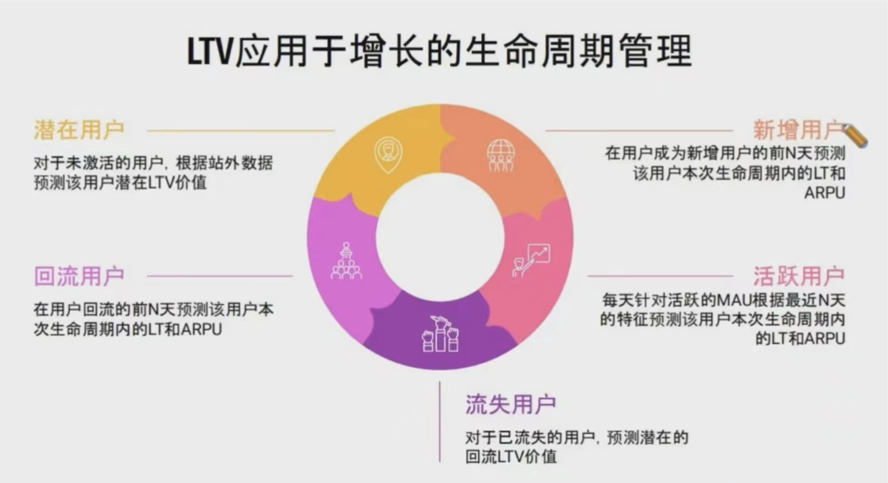

<!--
 * @Author: your name
 * @Date: 2021-04-20 10:26:59
 * @LastEditTime: 2022-08-01 16:25:47
 * @LastEditors: AlexZ33 775136985@qq.com
 * @Description: In User Settings Edit
 * @FilePath: /growth-hacker/docs/互联网运营: 留存、LTV、DAU.md
-->

# 价值模型

> 所有商业模式的根本模型

Profit = ROI * Quantity
# ROI


> ROI = Return - Investment
>         =  LTV -CAC

ROI(投入回报)有3种算法：ROI = LTV - CAC  关注单用户收益、ROI = (LTV - CAC)/CAC 关注投资回报率、ROI = LTV/CAC 关注投产比。
# CAC
> CAC: Custom Acquisition Cost 用户获取成本


# LTV

> LTV(Lifetime Value)生命周期总价值，是公司从用户所有的互动中所得到的全部经济收益的总和。
>  LTV: Life Time Value 用户生命周期价值 = LT * V

<b>LTV在用户增长的各个阶段起的作用</b>



<b>如何计算用户生命周期?(LT)</b>

$LT_m = \sum_ {i=1} ^m R_i = m R_{avg}$

> N个Ri的和，等于m乘以长留，长期留存，一般是指30天以上的留存
微分中值定理、积分中值定理、拉格朗日中值定理等，也能证明


# 留存

> 一切始于留存

- 第n天留存率 = 第n天仍活跃的用户数/ 第一天新增用户数
- 次日留存 = 第2天仍然活跃的用户数 / 第1天新增用户数
- 三日留存 = 第3天仍然活跃的用户数 / 第1天新增用户数
- ...

> 一个典型产品的留存数据

|   | 次日 | 3日| 4日| 5日| 6日|7日|
|---|---|---|---|---|---|---|
|  留存率 | 39.5%   | 25.9% | 20.5%|17.3% |15.5%|13.3% |10.3

互联网产品，次留<40% 是没有信心活下去的，至少要多余这个值。

## 留存的性质
> 一个产品的价值仅取决于留存

**Life Time (LT)的计算**

$LTm = \sum_{n=1}^m R_n$

## 留存率计算

## 留存曲线拟合

> 拟合留存的常用曲线：线性、多项式、对数、幂次、指数

留存率，在数据分析中，我认为是一个比较好用的指标，因为比较稳定，不会很容易受外界因素的干扰，大幅波动。例如活动，推广等。可以用来做用户的分类，做用户规模预测。
## 留存函数详解


## DAU
日活跃用户常用于反映网站、互联网应用或网络游戏的运营情况。DAU通常统计一日之内，登录或使用了某个产品的用户数(去除重复登录的用户)。
一般移动互联网中，因为app并非打开就必须登录，所以统计 DAU 以设备数为主，而非注册用户数。


- 对于系统内置APP，长留约等于日活渗透率；
- 提升DAU的关键在于提升长留；产品留存的最优曲线是留存起点高、衰减速率低； 
- LTV>CAC，我们会认为产品的投放是有回报是值得的。

$DAU_m = LT_m = \sum_ $
# 增长
增长方法：找到一个北极星指标；进入快速实验迭代阶段，以一两周为周期实验；将上一次的实验结果应用到下一次实验中，并时刻关注指标变化

# 投放
投放：不断优化投放素材，获取更精准的用户；果断放弃LTV远小于CAC的投放计划，及时止损
## ALTV

LTV总量就是ALTV（Aggregation LTV），对于任何产品，都要不断提升其ALTV。如果用一个公式来衡量一个用户增长团队的主要工作的话，那就是Max（ALTV）。

<b>如何提升ALTV? </b>

> 要提升ALTV，一般先要有一个能满足用户基础体验的产品，在体验达到一定门槛后，在后面持续优化体验的同时，可以尝试用各种方式拉新。只要用户的获取成本不高于ELTV，在预算允许的前提下应该大量拉新。在用户量积累到一定程度后，在持续拉新的同时要有增长项目提升用户的LTV。当产品有了一定的用户量，用户的LTV也在不断提升，处在上升期的时候，用户增长团队就要开始对新增长曲线的探索。

1. 是吸引更多用户(拉新)(`尤其是处于早期的产品，用户量基数比较小，更应该大力获取新用户，而且在获取新用户的时候，预算策略可以适度激进一点`)
    - 渠道投放
    - 激励用户邀请用户
    - SEO
    - 病毒营销活动

2. 提升每个用户的LTV, 需要设计一些有针对性的增长项目，引导用户产生HVA。[关于HVA](https://zhuanlan.zhihu.com/p/414626340)


<b>这类产品一般属于小团队或小公司, 基金量相对较小，　为何预算反而更激进? </b>

- 第一，在一个产品的早期，各项主要功能都处于基础水平，还在不断优化迭代当中，这个时候提供给用户的产品体验还是比较初级的。随着产品的迭代升级，用户的感受会越来越好，产品对用户的黏性也会不断提升。
- 第二，在一个产品的初期阶段，出于对用户体验的考虑，关于商业变现的探索往往是趋于保守的。随着产品的成熟、用户规模的扩大，以及商业化探索的增强，用户贡献的价值会不断提升。
- 第三，有很多互联网产品都是有网络效应的，一个典型的代表就是电商平台。随着卖家和买家的增多，平台上的交易量会呈几何倍数的增长，而不是线性增长。
- 第四，有了一定用户基础后，要想最大化ALTV,就不能只关注拉新了，还要提升每个用户的LTV


产品的早期阶段，我们要对用户生态的后续发展趋势及变现潜力有一个大致的预判，要用发展的眼光来评估当下的用户获取策略。因为很多互联网产品的边际成本非常低，所以扩张起来非常快。在这种情况下，速度非常重要。尤其是一些用户迁移成本比较高的产品，更要尽快把用户圈进来，让用户在使用产品的过程中不断增加迁移成本，从而让产品的竞争壁垒越来越高。如果一个领域的先发优势非常明显，那我们就更应该认真评估这一领域的早期用户获取策略。**在产品的早期阶段，我们一定要保持合理的激进，否则如果用一个偏低的ELTV来限制用户获取策略，会遗憾地错过一些本可以高速发展的机会窗口。**

```
注意：　大规模拉新之前，还有一点需要特别注意，那就是只有产品的基础体验达到一定门槛，才能让核心用户有相对较好的体验。用户有了比较好的体验，才能留存下来。但这并不是说要等我们把产品体验打磨到极致了才去拉新，而是说需要让用户能够比较流畅地体验完产品的核心功能，并且愿意再次使用。这样用户才有可能留存下来，并持续贡献价值。当然，无论产品体验被打磨到何种程度，总是会有用户因为不喜欢我们的产品而离开，这是正常的。所以在早期，产品的基础体验是最重要的，是数字前面的那个“1”。而用户增长则是数字后面的一串零，如果没有前面的“1”，零再多也没有用
```

## LT计算


# DAU
## DAU计算

### DAU与长留关系
https://www.freesion.com/article/6286506946/


# 如何做长留的增长
> - 长留指标的缺点：观察周期长、难以归因，不具备Attainable的特性，所以不是北极星指标

$DAU_m = DAU_{m-1} * r_2 + DOU + DNU = mR * DNU$

# QA

1. 
# 参考书目

- 
- 《我的一线做用户增重：存量时代的用户运营之道》
- 《增长黑客》
- [LaTex数学公式](https://www.jianshu.com/p/8c46e915c45e)


