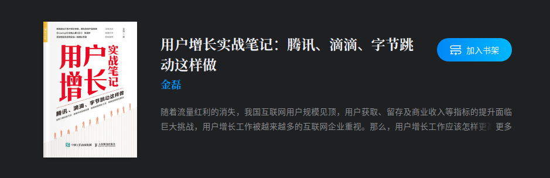
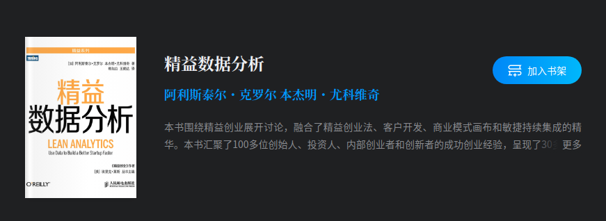
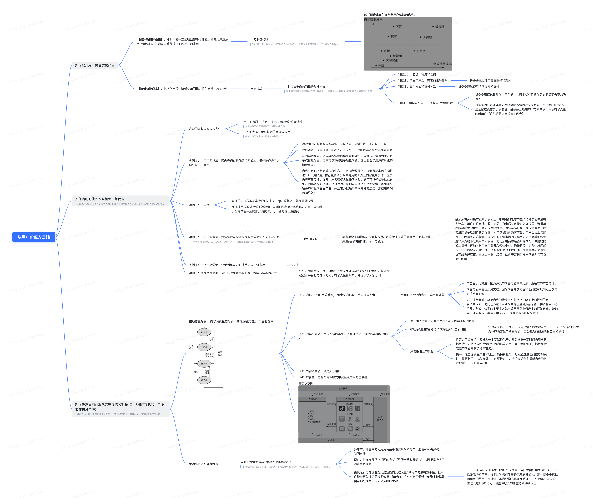
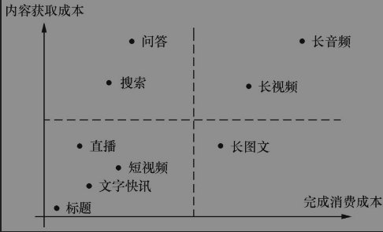
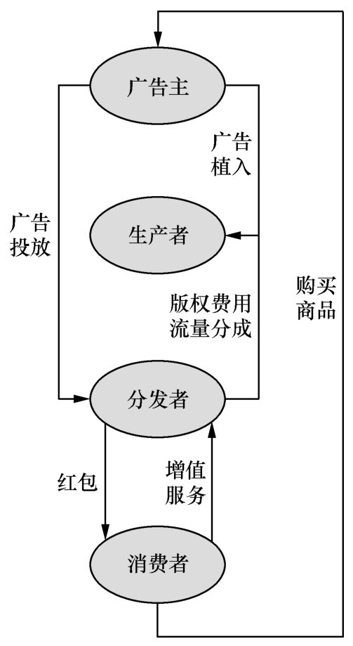
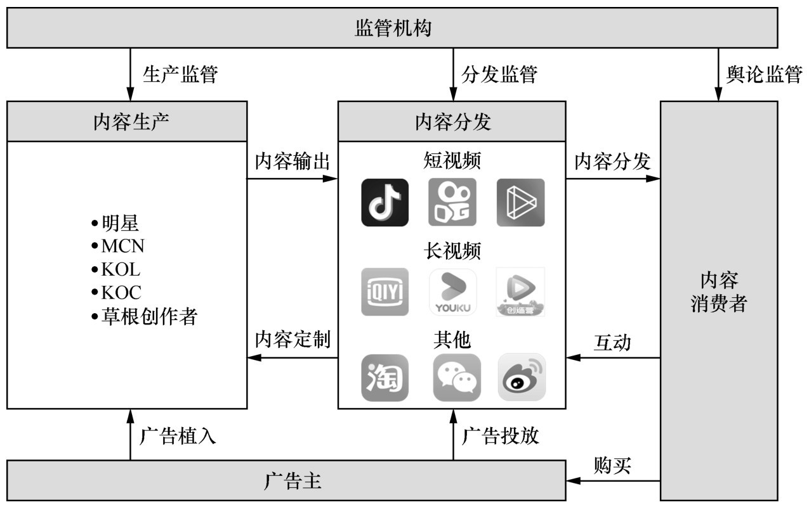
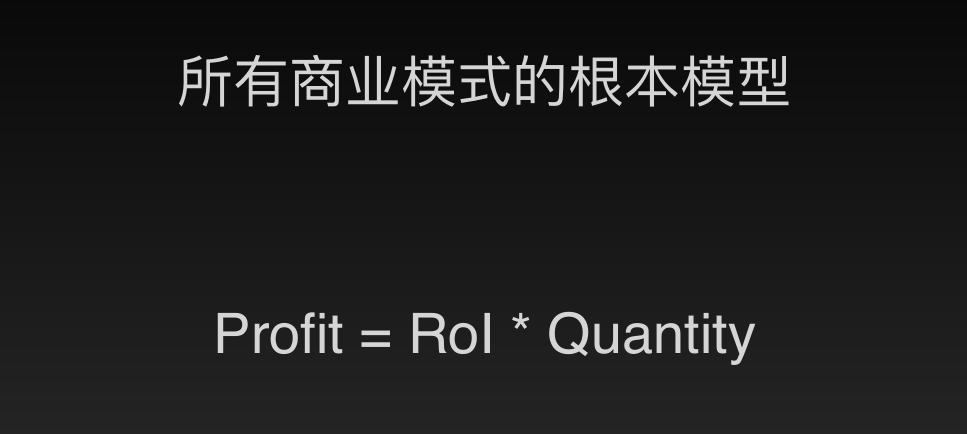
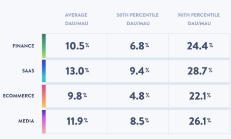
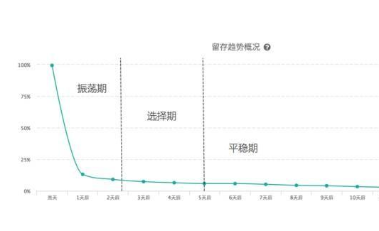
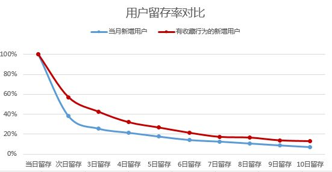

<!--
 * @Author: your name
 * @Date: 2021-04-16 10:22:32
 * @LastEditTime: 2021-04-20 10:45:42
 * @LastEditors: Please set LastEditors
 * @Description: In User Settings Edit
 * @FilePath: /growth-hacker/docs/互联网运营：快速开始用户增长.md
-->

前章提要

- 搭建增长团队的原因
  - 持续的增长需要有体系、有流程、不断实的团队形式

- 增长团队的职责
  - 以严格、成体系的实验流程去驱动增长

- 增长团队的终极目标
  - 商业目标: 降低CAC, 提升LTV, 以提高ROI，并扩大市场份额
  -  用户目标: 提升用户价值 = 新体验- 旧体验- 替换成本

- 工作方式
  -  MVP驱动: 最小化可行产品的方式推动
  -  快速迭代： 
  -  每周分析： 以周为单位，讨论成功失败经验，迭代AB测试

# 提升用户价值

## 【提升新旧体验差】

### 实例一 ：内容消费领域，大量用户流向短视频APP

> 2018年以来，我国互联网的用户规模和用户时长都在大量地流向抖音、快手等短视频App，而在此之前的内容消费形式以长图文（如微信公众号、今日头条）、长视频（如腾讯视频、爱奇艺）为主。

<b>以“消费成本”来判断用户体验的优劣。从用户角度出发，越容易完成目标内容的消费，这个内容平台提供的体验越能被认可</b>

- 内容获取成本: 用户获得目标内容需要付出的时间、操作甚至金钱; 
  - 如信息搜索要求用户先想到关键词，并且能够从搜索结果中找到真正想看的内容
- 完成消费成本：成用户完成内容消费需要付出的时间甚至金钱
  - 如某些长视频热播剧需要购买VIP之后才能观看完整版，并且看完一部剧集需要花费较长时间。

无论内容获取成本，还是完成消费成本，短视频均明显低于长视频，而短视频在完成消费成本一项则明显低于长图文。如果把短视频作为新体验、长图文作为旧体验，可知调整内容呈现形式可以提升新旧体验差。这就是我们提升用户价值的一个方向。

结合具体产品来看看抖音App如何提升了新旧体验差：它不仅提供了沉浸式的消费场景，用户的手机屏幕完全被视频内容铺满；还提供了便捷的操作，仅需要单手双击屏幕就可以完成一次点赞，仅需要手指上划就会进入下一条视频。

## 【降低替换成本】

### 实例二：　电商领域，拼多多

- 拼多多通过使用微信账号和支付，就轻松消除了用户从已有电商平台迁移而来的大部分替换成本（第三方账号和第三方支付的能力也已经开放给普通开发者）
- 如何吸引用户：拼多多用红包补贴作为杀手锏，让原本就有价格优势的商品变得更加吸引人

## 【利用宏观机会】
> 宏观机会只是必要条件，顺势而为、借助势能找到增长方向才是增长与否的关键

- 宏观的增长需要很多条件。除了技术的成熟，还需要考虑到两个重要的因素：<b>用户的意愿</b>和<b>生态的完善</b>
- 内容消费领域是如何迎合用户意愿、如何进行生态完善的?
    - 短视频的内容获取成本极低—无须搜索，只需要刷一下，停不下来
    - 完成消费的成本极低—沉浸式，不易跳出，好的内容甚至会连续看多遍
    - 直播的内容获取成本也很低—打开App，直播入口就在显著位置
    - 完成消费成本甚至低于短视频—直播的内容相对碎片化，无须一直观看，当完成感兴趣的部分消费时，可以随时退出直播间
    - 从内容本身看，短内容所承载的信息量相对小，以娱乐、消遣为主，以单点信息为主，用户可以不费脑子轻松消费，这也迎合了用户碎片化的消费意愿。
    - 内容平台也不断完善内容生态，并且向继续降低内容消费成本的方向推进
- 面对下沉市场激活的大趋势，企业又需要如何顺应用户意愿、完善生态呢？
  - 拼多多就从网络购物场景成功切入了下沉市场
  - 拼多多将乡村集市搬到了手机上，很有趣的是它的整个购物流程中没有购物车。用户在信息流中看中商品，点击后就直接进入详情页，选择单独购买或发起拼单，也可以直接拼单
  - 快手则是从内容消费切入下沉市场。
  - 快手的主张是让每个人都有自己的舞台，让下沉市场的用户可以轻松拍摄自己烧饭做菜、上山采摘、赶海捕鱼等生活点滴。这让观众们更有代入感，愿意持续观看内容并关注主播

- 借助宏观机会的案例还有很多。例如，2020年初的特殊时期，全社会对居家办公和线上教学有极高的诉求。在这个短期宏观势能下，钉钉、腾讯会议、ZOOM等线上会议及办公软件收获无数用户。众多在线教育平台也是这段时间获得了大量新用户，并逐步被大家认可。

## 【 优化商业模式】
从零开始构建一个商业模式过于宏大，可遇却不可求。而用户增长则可以着眼于现有商业模式的局部进行创新或优化。具体地说，就是补齐商业模式中的短板，或者消除制约商业逻辑正常运转的障碍
- 被动补齐短板
- 主动出击进行降维打击

###实例三，　内容消费生态

内容消费生态为例，其商业模式包含4个主要群体：
  > （1）内容生产者，负责将内容输出给内容分发者
  > （2）内容分发者，负责连接内容生产者和消费者，提供内容消费的场所；
  >（3）内容消费者，就是大众用户；
> （4）广告主，是整个商业模式中资金流的最初提供者。

- 通过引入大量的内容生产者弥补了内容不足的短板
- 帮助草根创作者跨过“拍好视频”这个门槛
  - 针对这个环节的优化正是用户增长的关键点之一。于是，短视频平台发力补齐内容生产端的短板，包括强大的视频编辑工具和滤镜
- 分发策略上的优化
  - 抖音：平台先将内容投入一个基础的池子，然后根据一定时间内用户的播放情况，将播放和反馈较好的内容流入用户量更大的池子；播放反馈较差的内容则会被冷冻或淘汰
  - 快手：注重连接生产者和粉丝，确保粉丝第一时间通过最低门槛看到关注主播更新的内容和直播。在首页推荐中，快手会提升主播新内容的推荐权重。无论侧重点在哪
<b>内容消费商业模式中的资金流向示意图</b>

> 大部分资金首先由广告主通过广告投放流转给内容分发平台，小部分则是通过内容里的广告植入直接提供给内容生产者。内容分发平台会购买版权支付给生产者固定费用，或根据内容消费情况（一般按播放量）给生产者支付流量分成。消费者在分发平台消费时，一部分直接支付了会员费等增值服务，另一部分则产生广告转化的消费，资金最终回流到广告主

<b>内容消费生态示意图</b>

> 除了传统的明星IP和传统影视传媒以外，还衍生了众多MCN、个人KOL（Key Opinion Leader，意见领袖）、KOC（Key Opinion Consumer，消费领袖），以及草根创作者。其中，MCN是一种多渠道网络的产品形态，它将用户产生的内容联合起来，在资本的有力支持下保障内容的持续输出，最终实现稳定变现。

### 实例四，电商和本地生活商业模式： 围绕佣金战
> 电商代表有阿里系、京东、拼多多，本地生活代表有滴滴、美团、饿了么。这两种商业模式都以B2C为主，其中一个重要的资金流向是平台向B端（包括商户端、司机、骑手等）收取佣金。平台提供了撮合供需的机会，消耗了不菲的带宽成本和其他运营成本，收取佣金是无可厚非的。而佣金比例是B端获得收益的最大影响因素，也是B端用户是否迁移的关键。所以，历年来每次电商大战、外卖大战、打车大战，平台都将减佣金、免佣金作为杀手锏。

- 多年前，淘宝最先利用免佣金策略实现降维打击，迫使eBay最终退出我国市场
- 现在，拼多多几乎以相同的方式（零服务费和零佣金）从阿里系吸收了海量草根商家
- 更具吸引力的佣金规则是短期内获取大量B端用户的最有效手段，但用户增长更关注的是长期效果。降低佣金后平台能否通过其他资金链路补回这部分成本，是未来成败的关键
  - 2018年初美团和滴滴之间的打车大战中，美团主要使用免佣策略，但最后没能坚持下来，说明这种极端手段的风险的确极大。现在拼多多挑战阿里系的故事仍在继续，其商业模式也还在验证中。2019年拼多多的广告收入达到300亿元，占整体收入的比重达到80%以上
# 概念学习

> 复习,运营时候常关注的指标

- 下载量
  - 应用的已下载数量，以及应用商店排名和评分等相关指标。

- CAC: 客户获取成本
    - 获取一位用户和付费客户的所需成本。会应用到单个用户收益中　ROI = LTV - CAC
- 激活率
- 应用运行率
    - 有多少下载用户真正开启了该项应用，并注册了账号。

- 活跃用户/玩家比例: 每天/月保持活跃在线的用户比例
  - DAU(Daily Active Users): 日活跃用户数
  - MAU(Monthly Active Users): 月活跃用户数

> 尽管很多专家认为“活跃用户”是虚荣指标，但是DAU / MAU任然是衡量初创企业，尤其是SaaS企业业绩最常用的数据

- 付费用户率
  - 有多少用户曾支付过费用。

-  首次付费时间
   -  用户激活后需要多久才会开始付费

- 用户平均每月营收（monthly AverageRevenue Per User, ARPU）
  - 该指标是购买和广告的收入总和，通常还包括特定于某个应用程序的信息，例如哪一屏或哪个物品最能吸引用户购买。此外还需跟踪ARPPU，即平均每位付费用户营收（AverageRevenue Per Paying User）。

- 点评率
  - 在应用商店为应用评分或评论的用户比例。

- 病毒性
  - 平均每位用户可以邀请多少新用户。

- 流失率
  - 卸载应用或一定时间段内没有开启过应用的用户比例。

- 客户终身价值( LTV,用户生命周期价值,Value)
  - 用户在使用应用期间为公司贡献的营收
# 不同类型互联网app比较

- Online publication: Visit, login, view a page, save a story
- Mobile gaming app: Create an account, play a game, share with friends
- SaaS application: Add a task, complete a task, invite a team member
- Personal finances app: Add an account, view a report, make a budget

<b>计算您的网站或应用的定期使用情况，其中一些是基于DAU的：</b>

- Average Daily Active Users (ADAU): This is the average DAU for a given month or 30-day trailing period. It’s what most people commonly mean when they refer to DAU.
- Daily new users and daily returning users: Within DAU, there are new users and returning users. Together, they equal the total DAU but separately, they allow product teams to measure how fast the app is attracting new users and keeping them coming back respectively.  
- Weekly Active Users (WAU): A weekly version of DAU. It’s a useful measurement for businesses whose apps are used predominantly during the workweek, such as productivity tools, analytics, forums, and social communities.
- DAU / Monthly Active Users (MAU): This is DAU divided by MAU. This ratio measures how sticky your product is, or how often people are engaging with your product. 

# 衡量用户价值

## 留存分析
留存分析是一种用来分析用户参与情况/活跃程度的分析模型，考察进行初始行为的用户中，有多少人会进行后续行为。这是用来衡量产品对<b>用户价值高低</b>的重要方法。

> 留存分析可以帮助回答以下问题：

> 一个新客户在未来的一段时间内是否完成了您期许用户完成的行为？如支付订单等；
某个社交产品改进了新注册用户的引导流程，期待改善用户注册后的参与程度，如何验证？
想判断某项产品改动是否奏效，如新增了一个邀请好友的功能，观察是否有人因新增功能而多使用产品几个月？

- 常见的留存曲线，我把它分成了三个部分：第一部分是振荡期，第二部分是选择期，第三部分是平稳期。

那我们怎么用留存分析呢？举个栗子：如图

细分用户群体，分析每个产品功能点对用户留存情况的影响，我们不仅可以把收藏拿出来对比，点赞，转发，评论，关注等等都可以对比

如果是电商的话还可以对比没有购买，购买1次、2次、3次、4次、5次、6次等

我们通过分析曲线找到留存最高的功能点或者行为点。魔法数字和魔法功能，

- 交易类，购买5次以上的用户留存率最高，那我们的策略既尽可能快的使用户达到5次购买（一定注意时间窗口）；
- 工具类产品，那就找到魔法功能，使用这个功能用户留存最高；
- 如果是UGC类那就找到用户发帖的数量或者用户使用的功能作为魔法数字和魔法功能。

