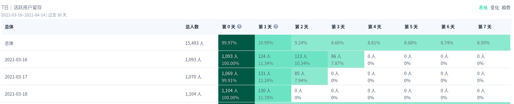

<!--
 * @Author: your name
 * @Date: 2021-04-14 10:05:10
 * @LastEditTime: 2021-04-15 19:51:27
 * @LastEditors: Please set LastEditors
 * @Description: In User Settings Edit
 * @FilePath: /growth-hacker/docs/互联网运营：用户增长主要工作(二).md
-->

前章节回顾

> （1）用户增长主要指用户规模及其带来的相关影响的增长。
> （2）用户增长以提升用户价值为基础。
> （3）用户增长需要全局视野：以用户价值为基础，通过对宏观机会和商业模式的洞察，借助数据驱动科学高效落地。
> （4）明确了增长目标后，用户增长的核心工作为“分析数据→形成假设→实验验证”的工作流，以及逐步完善这个循环。

用户增长是一个系统工程，近几年形成了一套成熟的工作流。增长目标是源头，数据贯穿工作流的主线，实验方法是至关重要的一环。

增长操盘手需要全盘了解工作流中的各环节，其他智能可以重点关注其中和自己相关度较高的内容
#1.  核心工作流

<b>理想态</b>

用户增长工作希望一开始便拥有完善的数据平台、标签体系、实验平台，甚至有不错的算法模型支持自动下发策略。

<b>实际</b>

用户增长也需要和时间赛跑，即使基础设施还没齐备，也要尽快开始积累正向经验。假设我们处在用户增长的最初阶段，应该如何快速地开展工作？

- 明确增长目标

> 参照北极星指标指定法
> 确定一个最能体现产品价值的增长指标，然后根据恰当的方式向下拆解增长指标（如杜邦分析法），直到拆解出的指标可以指导执行。
- 搭建增长模型

> 企业在做用户增长工作规划时需要关注全局，看整个用户链路和生命周期的各个环节。最常见的AARRR模型及强调留存的RARRA模型都能够很好地帮助我们做初步梳理，然而切入具体的工作时，这些“大模型”过于粗略，往往无法指导工作的展开。此时就需要我们对增长目标进行拆解，细化出具体的增长模型。

比如需要提升DAU(日活跃用户)，需要对DAU拆解（具体的拆解方案下面文章详解）
- 找到策略切入点

<b>因果性分析</b>
想知道某个指标为什么不涨，策略人员可以从产品逻辑推演和用户反馈中直接找到原因。定性的方法就是找典型用户去询问验证，定量的方法则可以通过最直观的漏斗分析来定位用户路径的“断点”。理解用户需求，提升用户价值，是产品经理、产品运营的必备技能。
<b>相关性分析</b>

找到高相关行为后，把具体策略定位到提升该行为频次或深度的指标，以验证是否能够增长目标。例如，活跃用户的次日留存与用户活跃当日的使用深度高度相关，包括信息流App的时长、图文阅读（PageView,PV）、视频播放（Video View,VV）等，我们可以优先提升这些指标。通过相关性分析找到策略切入点，是非常重要的用户增长手段。

> 当确定了增长方向后，用户增长主要的工作内容包括分析数据、形成假设和实验验证三部分，三者循环就是用户增长的核心工作流。

> 增长：找到一个北极星指标；进入快速实验迭代阶段，以一两周为周期实验；将上一次的实验结果应用到下一次实验中，并时刻关注指标变化

# 2 .团队分工

未补足岗位职能后面会详细讲解

# 3. 概念

我们之前知道(记不得小伙伴可以复习下)：

> ROI = LTV - CAC

我们看看业务关注点：LTV

> LTV = LT * V

## 3.1 LT & Retention & DAU

-   <b>LT：Lifetime</b>
用户平均生命周期，天/月
- <b> Retention </b>
  
  留存，某天新增的用户，在第N天打开APP的比例

- <b>- DAU：Daily Active User</b>
> 日活跃用户

-  DNU: Daily New User
> 日新增用户

真实APP的留存

会收敛到一个数值，经验上一个  app 次日留存40% ,七日留存20%, 30日留存10%才是相对比较好的，当然比这个值都高那更好。