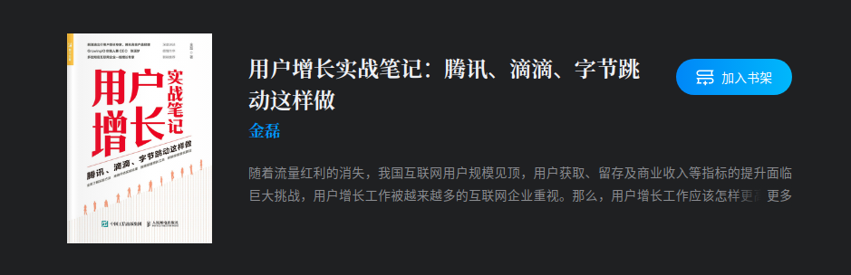
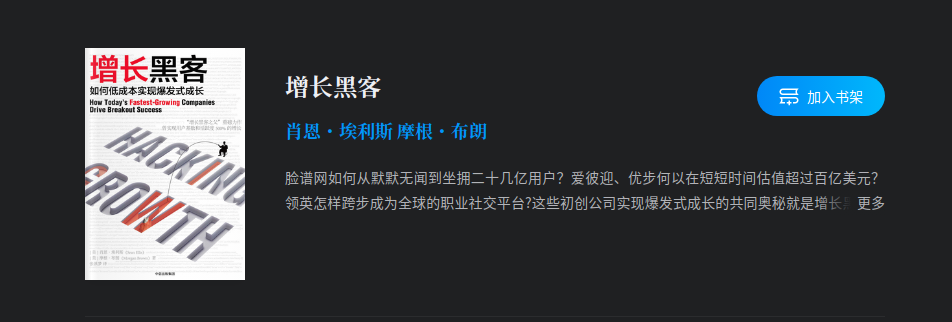
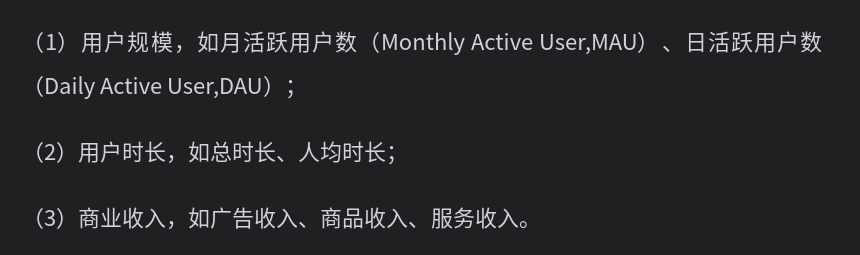
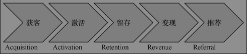
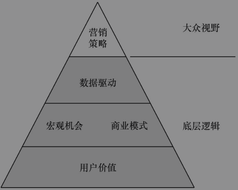
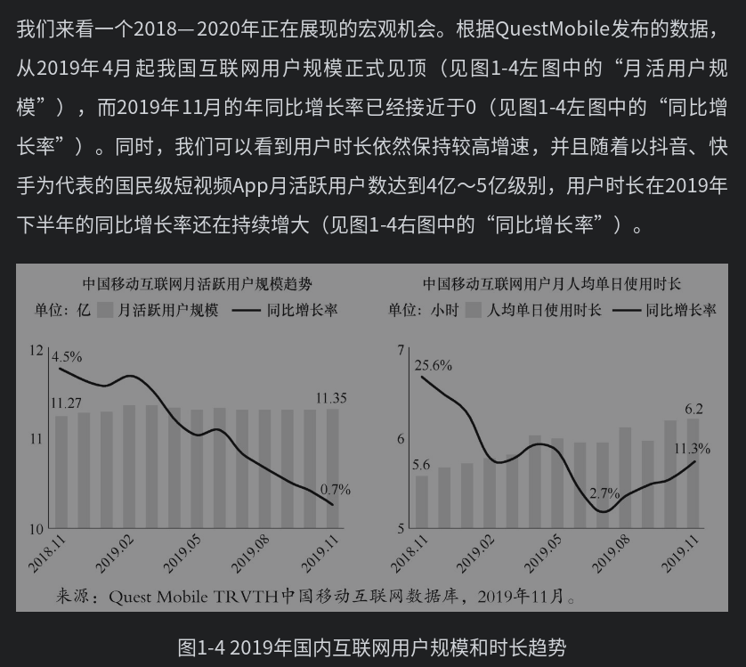
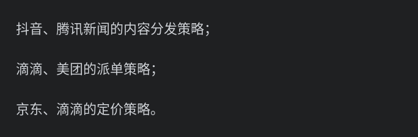
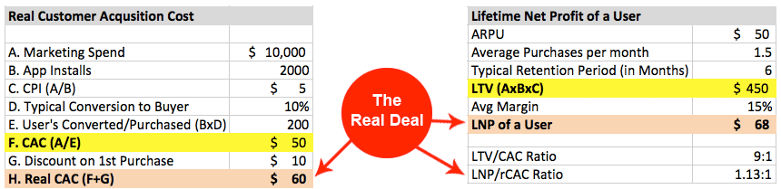

<!--
 * @Author: your name
 * @Date: 2021-04-13 20:06:18
 * @LastEditTime: 2021-04-13 21:27:12
 * @LastEditors: Please set LastEditors
 * @Description: In User Settings Edit1.
 * @FilePath: /growth-hacker/docs/tips.md
-->

> 以下内容主要来自以下书籍和学习培训

# 1. 用户规模最重要
> 对于以提供大众产品和服务为主的企业，用户规模及其增长预期对市值的影响尤为重要。绝大多数互联网企业都属于这一类，当形成规模经济之后，用户或客户越多，能够产生的边际收益就会越多，总体收益率也就越大

> 在同一个细分领域中，用户规模和市值高度正相关

# 2. 广告收入=活跃用户数×平均每用户收入

> 在一定时间内，平均每用户收入（AverageRevenue Per User,ARPU）是一个较稳定的值，它通常取决于广告主的竞价水平，且受整体行情影响。因此，总体广告收入主要由活跃用户数决定，这也解释了为何最近几年来互联网企业都格外重视用户增长

# 3. 用户增长

“用户增长”是指用户相关指标的增长，包含用户规模及其产生的各种影响，主要涵盖以下三个方面：

# 4. AARRR模型: 用户获取、用户激活、用户留存、用户推荐、盈利

# 5. 持续使用产品源于获得价值

用户使用产品获得了价值提升，包括但不限于获得好友、愉悦、知识、实惠、收入等，才会继续使用，甚至呼朋唤友一起使用
目前互联网业务的几个皇冠业务：
- 社交(如QQ,微信)
- 电商(淘宝，京东，拼多多)
- 信息流(如抖音，快手，今日头条)
- 内容社区，泛教育知识（知乎和Ｂ站）

# 6.增长动力来自提升用户价值

用户价值=新体验-旧体验-替换成本

价值提升的两个途径：
- 提升新旧体验差

> 除了保证新体验足够优秀外，产品或厂商需要用营销手段说服用户愿意尝试新体验。例如OPPO的宣传语，“充电5分钟通话两小时”的快充体验，用户一旦尝试过就很难再用回普通充电器。
- 降低替换成本

> 以理解成用户从一个产品迁移到另一个同类产品时，所需要花费的各种成本之和，包含如下载App、注册、绑定支付方式等
> 降低替换成本，除了狭义的降低支付成本，还可以推广至降低信息获取成本和完成消费成本。例如，划一下屏幕就能沉浸式观看的抖音和快手，省去货比三家的直播电商，都因不需要搜索和对比而极大地降低了用户的信息获取成本；短视频和直播的消费门槛几乎为零，相比图文信息，极大地降低了消费成本。

- 还有一个略显抽象的价值提升视角，便是网络效应。

> 《闪电式扩张》一书中给网络效应做了如此定义：“当增加任何一个用户都会增加产品或服务对于其他用户的价值时，这种产品或服务就会产生积极的网络效应。”这种效应也被经济学家称为“需求方规模经济”，通过用户间产生连接增加彼此的价值。网络效应最具代表性的案例就是社交网络，如微信和微博，随着用户增多，网络中的关系链越来越复杂。用户拥有更多好友，用户之间有更多互动，网络强度也会越大。如今的抖音和快手同样形成了巨大的网络效应，使内容生产和内容消费建立了连接。随着用户增多，内容生产者发布的视频能够有更多消费，也能获得更多激励；内容消费者能够获得免费优质的内容，也能够发表评论、参与互动，得到来自其他用户的反馈。因此，通过网络效应提升用户价值，也是获得增长动力的有效途径。它并不局限在具象化地提升某个用户的个人价值，而是从一个更高的维度产生系统化提升。

# ７．用户增长的全局视野

## 7.1 用户价值（道）
增长并非一个短时的、眼前的指标提升。

- 从时间维度来看，用户增长需要关注<b>长期的用户规模</b>，这依赖于用户认为产品有长期价值；
- 从空间维度来看，用户增长需要关注尽可能多的潜在受众，确保获得新用户，这就依赖于产品价值的传播。当产品不能给用户提供价值，无法让用户自发向身边的潜在用户推荐甚至提及这款产品时，它将很难获得增长。

## 7.2 宏观机会（道）

宏观机会能带来普遍利好，如果能够抓住机会借助势能，用户增长可以获得事半功倍的效果。
- 宏观机会有短时的。例如，2015年春节，微信支付借助春节红包一炮而红，迅速占据移动支付的可观份额。
- 宏观机会也有长时的。例如，时下异常火热的短视频和手机直播借助智能手机普及和移动网络低价化的势能，头部App在近两年获得了数以亿计的新用户
- 宏观机会还有未来的。例如，华为、小米、OPPO和vivo等手机厂商争相投入印度和南美市场，因为那里也将有类似我国过去几年的需求爆发式增长。

> 2019年11月，全网人均日时长已经达到6.2小时（见图1-4右图中的“人均单日使用时长”）。这是什么概念？假设人们每日平均睡眠6个小时，除去这个时间，用户每天依然有1/3的时间是在盯着手机屏幕。不夸张地说，手机已经变成了人类的一种“器官”，我们每个人都不可避免地被卷入了这个浩瀚的“时长池”中。由此可见，“流量池”在2019年完成了向“时长池”的转变，这里蕴含着宏观机会。这样的机会正是我们获得大规模用户增长所要重点把握的。

- 观念变革值得我们关心。

  > 例如，近年来流行的健身文化和随之而来的低糖低脂饮食风潮。在资源匮乏的年代，糖曾经是人们追求的快乐源泉之一。但是，如今过量糖分摄入容易引发肥胖，使“无糖”“0卡”的概念逐渐深入人心，形成了健康饮食的新趋势。在这个大趋势下，可口可乐这样的巨头也开始主推无糖产品零度可乐，在保留甜味的同时实现了无糖，因而深得人心。与此同时，另一家主打无糖饮料的品牌—元气森林也迅速走红于网络和线下商超。可口可乐借助零度可乐对冲了传统可乐销量下滑的影响，而以元气森林为代表的无糖饮料获得飞速增长。类似这样的消费趋势还有全面屏手机、多摄像头手机、真无线蓝牙耳机等，几乎每半年都能看到一次不小的消费观念变革

## 7.3 商业模式（道）
(宏观机会的利用往往体现在商业模式的创新和优化上。)

商业模式而言，都是描述一家企业如何通过生产、销售产品或服务来创造财务收益。每个行业都有一套生态，和我们熟知的自然界一样，每个角色都对所在生态产生影响，也能因此获得收益，这就是商业模式运行的结果。

> 近年来，内容消费领域呈现了一个完整的生态。而在几年前，里面的很多角色是不存在的。例如，多渠道网络服务（Multi-Channel Network,MCN）连接着草根内容生产者和内容平台，为普通内容创造者提供了专业化的包装能力，更好地打通了其触达内容消费者的通道，提升了生产者的影响力。MCN让内容消费的生态更加顺畅，同时也为它自身谋求到高额的收入分成。由此可见，在一个新的领域引入关键角色，能够很好地弥补商业模式中的空缺。2019年以来异常火爆的直播带货，原本内容平台也存在电商的通道，例如，短视频下方的购物链接。但这种方式还不够直接，货品和内容结合的质量也良莠不齐，整体转化率还有很大的提升空间。而电视购物已经存在了数十年，现在它被改良并搬到互联网直播平台，主播用更加轻松风趣、更具互动性和鼓动性的方式进行推销，商家能够更加高频替换货品。直播平台提供更加便捷的购买方式，这些举措都优化了电商的商业模式，为内容电商注入了新的动力。发现商业模式中的断点是找到用户增长方向的一个思路，这样带来的增长也更可能是长期有效的。

## 7.4 数据驱动(术)

广义的数据驱动包含数据分析、机会挖掘、实验验证认知、数据驱动决策等

用户增长中数据驱动的主要目的，

- 首先是找到具体切入点，然后是推进整个工作流。
- 找切入点是指通过对现有数据进行全局扫描、相关性分析等，从而发现问题或机会；
- 而推进工作流则是指通过实验方法评估策略效果，并基于此效果进行下一步的策略迭代。

数据驱动首先要<b>明确增长目标</b>。这个目标最好是企业从上到下都认同的核心指标，所有增长工作都将围绕这个指标进行拆解。最常见的方法就是先确定好北极星指标，然后按照杜邦分析法进行拆解，找到切入点

在用户增长中，<b>实验方法</b>是数据驱动中至关重要的一环。既然是做增长，就需要关注策略带来的指标增量，而实验方法是全球学术界、一线互联网企业公认的黄金法则。尽管实验面临一些挑战，也有很多场景无法进行理想的实验，但它依然是满足条件时的首选

一些传统运营的策略，主要依赖人力来完成配置和迭代。而在算法主导的内容推荐、动态定价、补贴策略等领域，算法模型已经能够智能地完成个性化、全局最优的策略下发，并且能通过强化学习不断完成效果的自我优化

这些算法策略中的代表有以下三类：

，数据驱动能帮助我们评估营销策略的效果，为营销策略的迭代服务，为增长目标的实现提供保障。这部分内容在用户增长工作中非常重要，但同时也是从业者普遍欠缺的

要强调的是，数据驱动及后续的营销策略都是在为提升用户价值、优化商业模式服务。当然，并非凡事都需要数据化、用数据来驱动，而是主张围绕一个增长目标做精益的数据分析和策略挖掘。总体而言，数据驱动是为提升增长策略的准确性和效率服务的，它所能发挥的效果很大程度上取决于产品方向和商业模式

## 7.5 营销策略

用户增长所涉及的产品、运营策略都包含在广义的营销策略中。概括地说，营销策略是一个直接面向用户的界面，它的作用主要包括
- 向用户传递信息
- 讲清楚利益点
- 与用户进行互动
- 引导用户完成关键行为
- 最后促进增长目标的达成。

在用户增长中，企业可以通过有针对性的实验来探索营销策略的最优效果。例如，电商App中常见的商品促销界面会向用户呈现购物“满多少可以减多少”的信息，这里涉及两个数值变量。企业如果拿不准如何设计，可以通过实验验证何种数值组合能够带来最大的<b>GMV（成交总额）</b>或最优的<b>ROI</b>（投资回报率）。

### 概念1: ROI
ROI: Return on Investment , 投资回报

> 所有业务模型的根本模型
> Profit = ROI * Quantity

<b>ROI的几种计算公式</b>
> 在不同的语境，不同的业务场景下，ROI的定义会有一个差异

| 关注单用户收益       | ROI = LTV -CAC|  
| --------   | -----:  | 
| 关注投资回报率      | ROI=(LTV-CAC)/CAC |   
|关注投入产出比    |   ROI=LTV/CAC   |   

### 概念2: CAC & LTV
CAC: Customer Acquisition Cost
用户获取成本

LTV: Life Time Value
用户生命周期价值

相关概念
CLV: Customer Lifetime Value
LTV的别称，客户生命周期价值

LNP：Lifetime Net Profit
用户生命周期净利

rCAC: Real CAC
真实CAC，除了投放成本，还考虑用户补贴等
<b>ROI计算案例</b>

> 例如，从内容消费App的数据中可以分析得出，用户一旦与他人产生互动（转发、评论、点赞），其后续留存率就会显著提升。针对这个分析结论，产品中可以设计一些引导用户完成转、评、赞的小功能。例如，在用户发布内容后默认会得到一些点赞，将极大促进其发布内容的积极性；签到打卡功能，打卡7次可以瓜分奖金，在用户第1次打卡后可再赠送1次打卡机会，实验证明被赠送的用户群最终打卡满7次的比例显著高于未赠送的群组。
