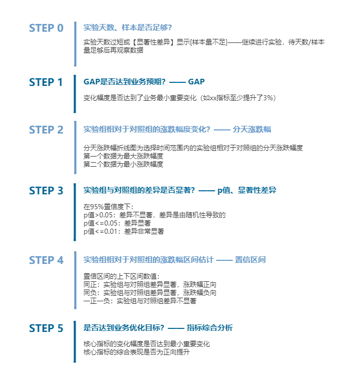

<!--
 * @Author: zhaokang zhaokang1@xiaomi.com
 * @Date: 2022-06-09 13:29:25
 * @LastEditors: zhaokang zhaokang1@xiaomi.com
 * @LastEditTime: 2022-06-09 13:33:41
 * @FilePath: /growth-hacker/docs/实验统计指南.md
 * @Description: 这是默认设置,请设置`customMade`, 打开koroFileHeader查看配置 进行设置: https://github.com/OBKoro1/koro1FileHeader/wiki/%E9%85%8D%E7%BD%AE
-->

# 什么是AB实验
AB实验的本质是分离组间实验，即为同一目标设计两个或多个方案，在同一时间维度，分别让两个或多个用户组（属性相似）使用其中一个方案，收集各群组的用户体验数据和业务数据；然后通过统计学方法对收集到的数据进行分析，比较各方案对于给定目标的转化效果，分析评估出最优版本。

# 如何分析和解读实验数据

