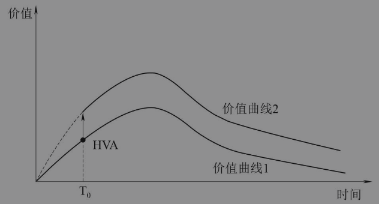

<!--
 * @Author: your name
 * @Date: 2021-09-27 17:06:59
 * @LastEditTime: 2021-09-28 11:39:39
 * @LastEditors: Please set LastEditors
 * @Description: In User Settings Edit
 * @FilePath: /docs/互联网运营: HVA.md
-->

# HVA

> HVA是high value action的首字母缩写，即高价值行为。

用户增长基本常识：任何产品肯定都希望提升自己用户的LTV。那如何才能提升用户的LTV呢？
很重要的一个方法就是：　 引导用户产生HVA(高价值行为)

> 户LTV的提升和个人的成长有很多类似之处，一般在经历过一些关键事件或者重大项目之后，人的认知、经验、能力都会有所提升，用户LTV也是这样的。如果用户在我们的产品上产生了一些关键行为，那他的整个LTV曲线就会发生跃迁。

在开始使用某个产品后，用户会随着时间的推移不断贡献价值，整个曲线下方的面积就是用户的LTV。

如果在时间T0上用户产生了一个HVA，那么他后续的价值贡献轨迹就会发生跃迁，从价值曲线1跃迁到价值曲线2，跃迁到一个用户价值贡献更高的轨迹上。这样一来，后续曲线下面的面积也就更大，即LTV随着价值曲线的跃迁而变大。

<b>示例：</b>

- 如有些用户在健身app上只购买课程不会在商城购买健身器材和周边。
- 购买课程属于价值曲线1
- 购买课程　+  在商城购买商品  属于价值曲线2　
-  而触发价值曲线跃迁的就是产生在商城首次购买这个行为（也就是说引导客户在商城首次购买，　就提升了用户的LTV）

<b>如何引导用户首次购买?</b>

- 发一张商城折扣券（需要加上各种限制条件，　比如最高抵扣金额，使用期限，限制具体品类，引导按照期望方式购物）

<b>常见的HVA</b>

- 用户注册
- 用户首单
- 用户关注其他用户或者内容

其实，找到用户的HVA并不难，真正有难度的是如何量化评估每个HVA的价值。

