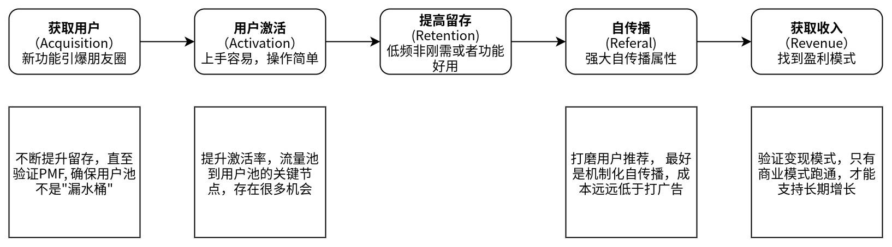

<!--
 * @Author: your name
 * @Date: 2022-03-30 19:49:30
 * @LastEditTime: 2022-03-30 21:26:07
 * @LastEditors: Please set LastEditors
 * @Description: 打开koroFileHeader查看配置 进行设置: https://github.com/OBKoro1/koro1FileHeader/wiki/%E9%85%8D%E7%BD%AE
 * @FilePath: /growth-hacker/docs/用户增长: 增长的可行性.md
-->
互联网产品的死法：

- 生于拉新，死于留存
- 生于拉新，死于变现
  
所以，在投入很多资源做增长之前，我们需要想办法降低风险

精益创业有两个假设
- 一个是价值假设，是不是成立？ 用户是不是需要
- 另一个是增长假设， 一旦推出去后，市场是不是足够大？如果放到真正的市场上， 会不会有同样效果

做增长之前确认产品是否达到PMF, 不可盲目拉新

# PMF分析

> PMF 产品市场契合(Product Market Fit) : 用户需要你的产品， 较长时间内重复使用他

PMF其实就是为了验证你的产品是否能够满足市场需求并从中获利（商业模式验证），换一种比较通俗、不太严谨的说法，其实就是让你做几个成功案例来验证产品和项目可行性。

如果不是很确定有没有达到PMF，你可以去制定北极星指标、增长模型，以此帮助你理解业务，但不建议花大钱去做拉新，否则很有可能把钱都打水漂。

<b>如何看产品是否达到PMF?</b>

直观表现：
- 产品无需付费买量，自然增长
- 用户口口相传，口碑营销
- 核心用户留存和使用率高
- 客服和服务器开始不够用

数据表现：
- 长期使用用户的调研如果有40%的表示如果不能使用有损失感或者失望
- 看留存曲线是否有平缓时刻了（有长留了）

# 特殊情况

但有几种特殊情况，是可以在确定达到PMF之前就去做大规模拉新的：

- 某些产品需要一定用户量才能跑。比如微信这样的社交产品，像珍爱网这样的相亲产品，就需要比较多的用户，优化产品才有意义
- 平台类产品，必须有一定供给量和需求量，双方才能留得住，且双方都是产品的一部分，不仅仅是用户。比方像滴滴、美团，有一定量的司机、供应商才有可能去打车、拼团，才能试出来体验好不好，产品行不行，有一定量的用户，司机和供应商也才能留下来
- 不差钱，真的不差钱（其实不推荐，除非产品需要快速抢占市场，因为产品的琢磨过程很重要）

