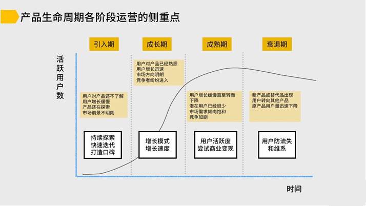

<!--
 * @Author: your name
 * @Date: 2022-03-30 21:27:11
 * @LastEditTime: 2022-03-30 21:52:54
 * @LastEditors: Please set LastEditors
 * @Description: 打开koroFileHeader查看配置 进行设置: https://github.com/OBKoro1/koro1FileHeader/wiki/%E9%85%8D%E7%BD%AE
 * @FilePath: /growth-hacker/docs/用户增长: 增长的重点.md
-->
1. 你的市场是那个阶段？

存量市场还是增量市场

增量市场： 
- AARRR重点： 获客
- 跑马圈地，抢占流量红利

存量市场：
- AARRR重点: 留存和变现
- 优化产品服务，从每个用户身上获取更多价值
  - 精细化运作，提高留存率和复购率
  - 增加增值服务，提升客单价和ARPU
  - 增加新的使用和付费场景
  - 寻找新的增量市场

1. 产品处于生命周期的哪个阶段？

主要有四个阶段：探索期、成长期、成熟期、衰退期

探索期：产品刚起步，还不完善；市场上竞品很少，用户对于产品不熟悉

成长期：产品形态固定，市场上开始出现大量竞品，用户对产品迅速理解

成熟期：产品基本完全定型，市场竞争环境恶化

衰退期：产品没有大动作，用户活跃降低，竞品主导市场

1. 产品是什么品类？

2. 商业模式中还有哪些独特的重要因素

