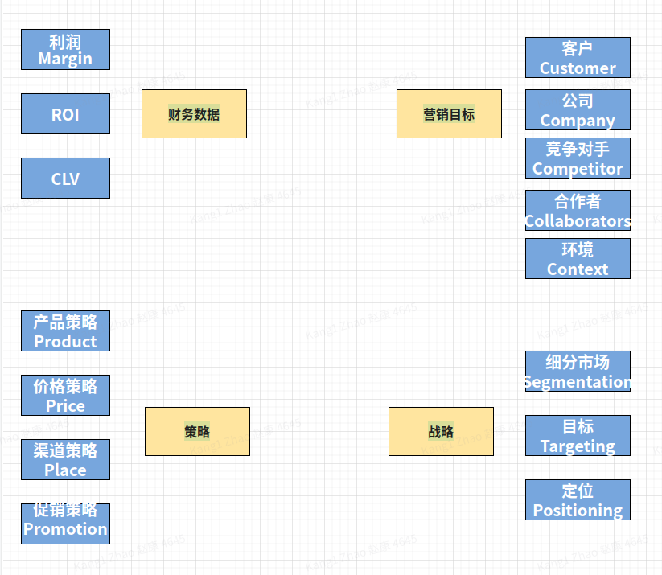

# 一、营销流程 Marketing Process

> The marketing process consists of four elements: strategic marketing analysis, marketing-mix planning, marketing implementation, and marketing control.
> 营销过程包括四个要素：战略营销分析、营销组合规划、营销实施和营销控制。

## marketing objectives 营销目标
> 营销过程实际上是从目标开始的。

**5Cs营销理论：**

- Customer
- Company
- Competitor
- Collaborators
- Context
##  marketing tactics 市场营销策略（战术）

> Marketing tactics营销策略（战术）探讨的其实就是如何让marketing strategy营销战略变为现实。营销战略marketing strategy是抽象宏观的表述，而营销策略marketing tactics则是具体可被执行的战术或措施。

一般可以从4个方面来考虑营销策略marketing tactics，即**4Ps营销理论：**
- **Product产品策略:** 顾客最看重你的产品的哪些部分，你是否应该调整你的产品以满足顾客需求

指将提供给客户的产品或产品组。对于汽车等实物产品(physical product)，公司将收集有关目标市场所需功能和优势的信息。在组装产品( assembling a product)之前，营销人员的职责是将客户的需求(customer desires)传达给设计产品或服务的工程师。这与过去的做法形成鲜明对比(in contrast to past practice)，过去工程师根据自己的偏好、兴趣或专业知识设计产品(based on their own preferences, interests, or expertise)，然后期望营销人员找到尽可能多的客户来购买该产品。当代思维要求产品的设计基于客户输入，而不仅仅是工程师的想法(Contemporary thinking calls for products to be designed based on customer input and not solely on engineers’ ideas)。在传统经济中，生产和消费的商品往往一代又一代保持不变——包括食物、衣服和住房。随着经济的发展，可用产品的范围往往会扩大，产品本身也会发生变化。在当代工业化社会中(contemporary industrialized societies)，产品和人一样，都会经历生命周期(go through life cycles)：诞生、成长、成熟和衰退。这种用新产品或更改产品不断替换现有产品的做法对专业营销人员产生了重大影响。新产品的开发涉及企业的方方面面——生产、财务(finance)、研发，甚至人事管理(personnel administration)和公共关系( public relations)。
- **Pricing 价格策略：** 例如，如果你想要参与竞争，那么你可能要选择是少量高利润地销售，还是低利润大量地销售。记住有些顾客可能会因为预算而更倾向于低价，而另一部分顾客可能把低价解读为与质量水平挂钩。因此采取什么样的价格策略要谨慎。

通常，公司通过衡量报价的质量（gauging the quality）或性能水平来确定价格，然后选择反映市场对其质量水平的评价方式的价格。但是，营销人员也意识到价格可以向客户发送有关产品假定质量水平的信息。梅赛德斯-奔驰汽车通常被认为是高品质汽车，因此可以在市场上获得高价。但是，即使制造商可以将其汽车定价为与经济型汽车相比具有竞争力，它也可能不会这样做，因为它知道较低的价格可能会传达较低的质量。另一方面，为了获得市场份额，一些公司已经转向“以同样的价格”或“以少的价格”定价，这意味着提供始终低于竞争对手的价格。这种折扣定价导致航空公司和制药等行业的公司（过去根据其过去的品牌实力和声誉收取溢价）大幅重新评估其营销策略。

- **Place渠道策略：** 如何、在哪里出售你的产品。这里通常会包括不同的分销渠道，比如通过互联网销售、或者通过零售店销售。

当一种产品沿着其从生产者到消费者的路径移动时，就可以说它是在遵循一个分销渠道。例如，许多食品的分销渠道包括食品加工厂、仓库、批发商和超市。通过使用这个渠道，食品制造商可以确保其产品在目标市场的人经常光顾的商店中，从而使其产品易于获得。在另一个例子中，共同基金组织通过寻求经纪公司和银行的协助来提供其投资产品，而这些机构和银行又与特定客户建立关系。但是，每个渠道参与者只能处理一定数量的产品：超市空间有限，投资经纪人只能跟上有限数量的共同基金。正因为如此，一些营销人员可能决定跳过渠道中的步骤，而是通过工厂直销、直邮和通过互联网购物直接向买家推销（这是 20 世纪后期的一个重要趋势）。
- **Promotion促销策略:**  你如何触及你的现有顾客和潜在顾客，比如广告、公关（PR）、促销信件（direct mail）等。

它包括与客户沟通和影响客户的几种方法。主要工具是销售人员、广告、促销和公共关系。

如果要考虑得更加深入，还可以增加三个部分，合起来即**7Ps营销理论：**
- **People人员策略：** 比如，你需要确保你的员工都接受了正确的培训
- **Processes流程策略：** 正确的流程，及良好的过程管理，能够确保你可以提供适合顾客的、连续性的服务
- **Physical evidence有形展示策略：** 例如你的员工的形象、公司建筑的形象，甚至收据等公司文件的质量等，都会影响顾客对你的公司、产品和服务的看法和印象。
# 二、爱比迎营销流程

# 三、练习测验： Marketing Process

# 参考
- [The marketing process](https://www.britannica.com/topic/marketing/Price)
- [弗吉尼亚大学:Marketing Analytics ](https://www.coursera.org/learn/uva-darden-market-analytics/home/week/1)